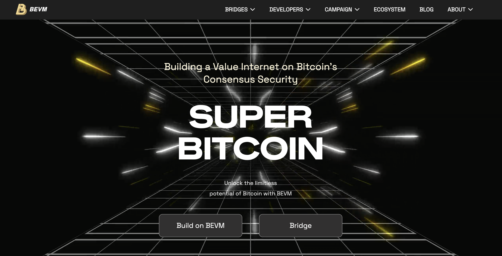

# BEVM

BEVM is an EVM-compatible sidechain built on substrate. On the BEVM chain, the BTC is held in custody by a federated signer set.

Attributes:
- EVM-compatible
- BTC-backed
- Mainnet
- Sidechain
- WBTC Fee Token

Links:
- [Website](https://www.bevm.io)
- [Docs](https://documents.bevm.io)
- [Explorer](https://scan.bevm.io)
- [GitHub](https://github.com/btclayer2/BEVM)
- [Twitter](https://twitter.com/BTCLayer2)
